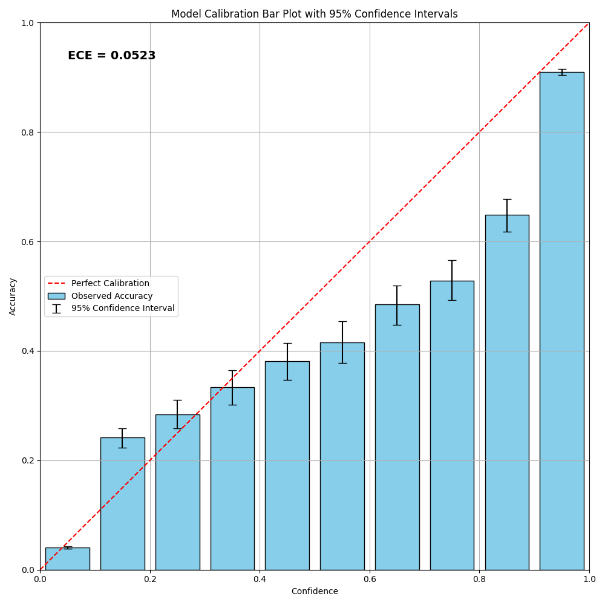
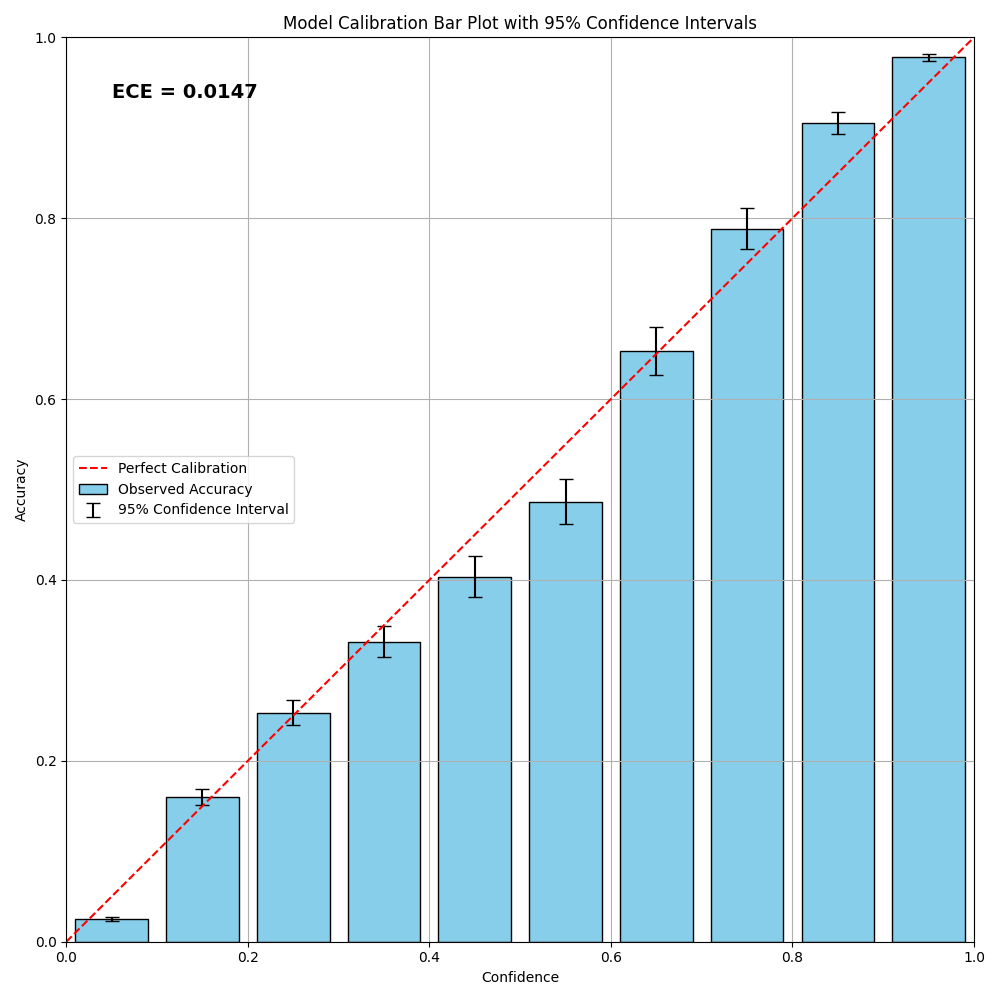
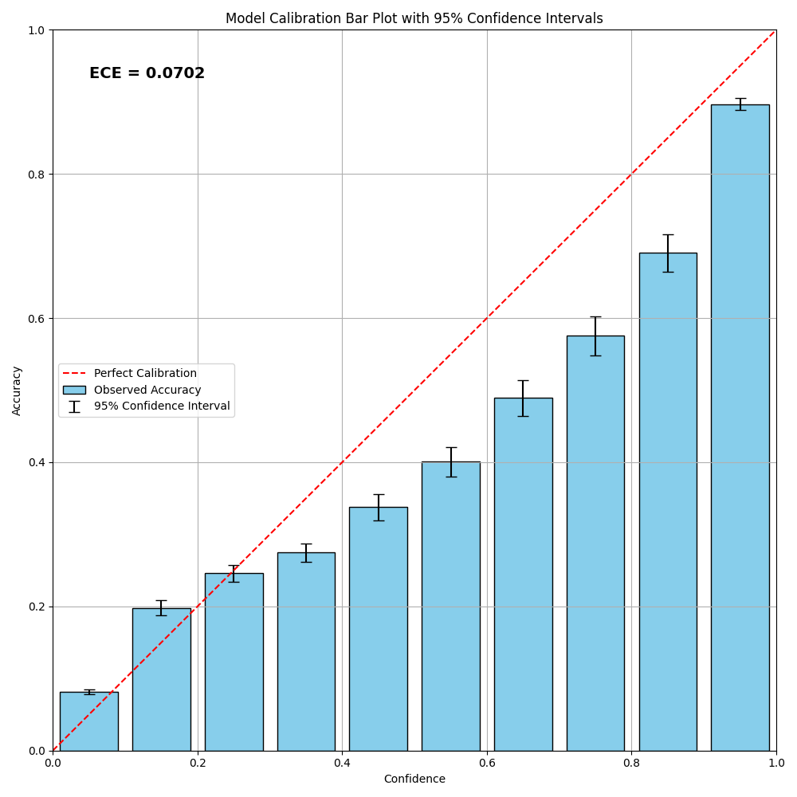
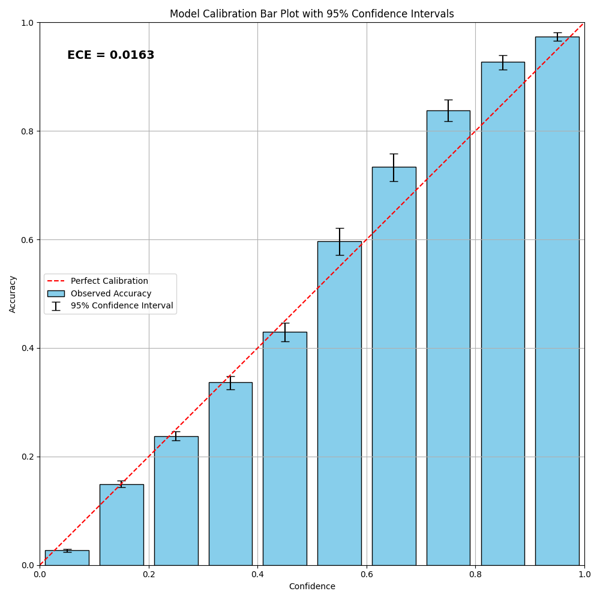

# llm-calibration

```bash
bash scripts/run_base.sh
```

# Results
Compute calibration plot using MMLU for either base model or instruction-fintuned LLMs.

> Llama 3.1 70B Instruct



> Llama 3.1 70B Base



> Llama 3.1 8B Instruct



> Llama 3.1 8B Base

